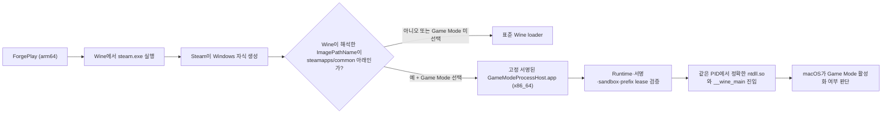
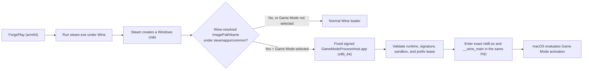

# ForgePlay Source — 한국어

[English](README_EN.md) | [언어 선택](README.md)

## 먼저 밝히는 입장

CodeWeavers가 Wine 생태계에 기여한 사실과 그 공로는 존중받아야 한다.
그러나 그 기여가 Wine의 공개 소스, macOS의 공개 동작, 또는 Windows
게임 호환 계층을 설계할 권리에 대한 독점권을 뜻하지는 않는다.

ForgePlay가 출발한 문제의식은 단순하다. macOS에서 Windows 게임을
실행하는 상용 제품군에는 오랫동안 CrossOver와 실질적으로 견줄 만한
경쟁자가 거의 없었다. 경쟁이 부족하면 다른 구조가 가능한지 검증할
압력도 약해진다. ForgePlay는 “CrossOver와 다른 구현 경로도 실제로
동작할 수 있다”는 주장을 말이 아니라 공개된 소스와 재현 가능한
구조로 입증하기 위해 만들었다.

같은 문제를 해결한다는 사실만으로 한 제품이 다른 제품의 복제품이
되지는 않는다. 판단할 것은 이름이나 인상이 아니라 실제 출처,
코드의 경계, 빌드 구조, 포함된 구성요소와 각 라이선스다. 그래서
ForgePlay는 핵심 구현을 비공개로 감추지 않고 이 소스 트리로 공개한다.
누구든 코드를 읽고, 비교하고, 포크하고, 주장에 반박할 수 있다.

## ForgePlay가 아닌 것

- 설치된 CrossOver를 실행하거나 감싸는 프런트엔드가 아니다.
- CrossOver의 bottle 디렉터리, 제품 번들, 실행 파일 또는 비공개
  패치에 의존하는 구조가 아니다.
- CodeWeavers의 비공개 구현을 ForgePlay의 독자 코드라고 주장하지
  않는다.
- Wine, D3DMetal 또는 제3자 구성요소의 권리까지 ForgePlay가
  소유한다고 주장하지 않는다.

ForgePlay는 Wine을 기반으로 한다. 사용한 Wine 소스와 패치는
버전·해시·출처와 함께 공개한다. D3DMetal은 별도 제3자 구성요소이며
이 소스 배포본에 바이너리로 포함되지 않는다. 공개 소스와 별도
라이선스 구성요소를 함께 배포하는 것, 그리고 그 결과물을 유료로
판매하는 것은 서로 모순되지 않는다. CrossOver의 판매 방식 자체가
다른 구현에 대한 독점 권원을 증명하지도 않는다. 각 프로젝트는
자신이 실제로 배포하는 구성요소와 그 조건으로 평가되어야 한다.

## Steam 연동은 실제로 어떻게 동작하는가

정확히 말하면 ForgePlay는 Steamworks SDK를 링크하거나
`steam_api.dll`/`steam_api64.dll`을 후킹하는 방식이 아니다. 또한
비공개 Steam API를 가장하지 않는다. ForgePlay가 사용하는 것은
Steam의 로컬 설치 메타데이터, 실제 Steam 클라이언트, 그리고 Steam이
만드는 정상적인 프로세스 계보다.

1. `SteamLibraryScanner.swift`가 Steam의 `libraryfolders.vdf`와
   `appmanifest_*.acf`를 읽어 설치된 라이브러리와 게임 메타데이터를
   찾는다.
2. ForgePlay가 관리하는 Wine prefix에서 실제 `steam.exe`를 실행한다.
   ForgePlay가 게임 실행 파일을 Steam인 것처럼 대신 실행하지 않는다.
3. Steam이 Windows 쪽의 정식 부모 프로세스로 남아 게임 또는
   런처 자식을 생성한다.
4. ForgePlay의 Wine 패치는 프로세스 생성 경계에서 선택된 렌더러
   정책과 Steam 게임 계보를 자식에게 전달한다.
5. Game Mode 대상 여부는 명령행, 게임 제목, 계정명, 볼륨명 또는
   Steam App ID를 신뢰해서 정하지 않는다. Wine이 해석한
   `RTL_USER_PROCESS_PARAMETERS.ImagePathName`을 Unix 쪽에서 검사한다.
6. 경로 구성요소가 `steamapps/common` 아래에 있는 실제 실행 파일만
   대상으로 인정한다. `_CommonRedist`와 그 밖의 인프라 프로세스는
   제외한다. 런처가 나중에 장시간 실행될 진짜 게임 자식을 만들면
   그 자식도 독립적으로 다시 판정한다.

이 방식에서 Steam은 로그인, 업데이트, 소유권 확인, 게임 선택과
자식 프로세스 생성을 계속 담당한다. ForgePlay는 그 정상 실행
계보를 보존하면서 Wine 내부의 프로세스 경계에서 호환성 정책만
적용한다.

## 렌더러 선택과 Game Mode는 분리되어 있다

Steam 세션을 시작하기 전에 사용자는 D3DMetal, DXMT, D9VK, DXVK 중
정확히 하나를 선택한다. Steam 클라이언트와 Steam WebHelper는 기본
Wine 렌더러 경로에 남고, 선택된 렌더러는 `steamapps/common`에 속한
게임 자식에만 적용된다. 선택이 없거나 잘못되면 다른 렌더러로
조용히 대체하지 않고 실행을 거부한다.

렌더러 선택과 Game Mode 대상 판정은 독립적이다. D3DMetal을
선택했다고 Game Mode가 자동으로 켜지는 것도 아니고, Game Mode를
선택했다고 렌더러가 바뀌는 것도 아니다.

## Game Mode 구현

일반 Steam 세션은 표준 Wine loader를 사용한다. Game Mode 경로는
사용자가 명시적으로 선택하는 beta 기능이다.



구현 흐름은 다음과 같다.

1. ForgePlay 본체가 고정된 host bundle과 정확한 runtime identity를
   먼저 검사한다.
2. Steam이 만든 대상 자식이 PE mapping을 시작하기 전에, Wine loader가
   그 프로세스를 앱 내부의 고정 경로
   `Contents/Helpers/GameModeProcessHost.app`으로 `exec`한다.
3. 이 전환은 새 게임별 앱을 생성하지 않는다. 기존 Darwin PID,
   `argv`, 현재 디렉터리, 상속 handle과 Wine server 문맥을 유지한다.
4. `GameModeProcessHost`는 ForgePlay 본체와 별도로 빌드되는 고정
   `x86_64` Mach-O application target이다. Apple Silicon에서는
   Rosetta를 통해 실행된다.
5. host는 자신의 bundle identity, 코드·runtime identity, app-group
   sandbox 경계, 고정 IPC/evidence 경로, Wine loader 경로와 해시,
   prefix execution lease를 다시 검증한다.
6. 검증이 끝나면 정확히 번들된 `x86_64-unix/ntdll.so`를 열고 같은
   PID에서 `__wine_main`으로 진입한다.
7. host 또는 필수 계약 검증이 실패하면 일반 Wine 경로로 몰래
   fallback하지 않고 해당 자식을 실패시킨다.
8. host는 `LSSupportsGameMode=true`와 games category를 선언한다.
   실제 Game Mode 활성화 여부는 ForgePlay가 강제로 결정하는 것이
   아니라 macOS가 실행 문맥을 보고 판단한다.

따라서 “독자 바이너리”라는 표현은 정확히 다음을 뜻한다.
`GameModeProcessHost`는 ForgePlay 프로젝트가 별도 target으로
컴파일·서명하는 고정 Mach-O 실행 파일이다. CrossOver의 host
바이너리를 실행하거나 이름만 바꾼 것이 아니다. 다만 그 바이너리가
Wine과 무관한 완전 신규 loader라는 뜻은 아니다.

## 클린룸 구현과 Wine 유래 부분의 정확한 경계

ForgePlay는 강한 주장을 하되 출처를 흐리지 않는다.

| 영역 | 구현 및 출처 | ForgePlay의 주장 |
| --- | --- | --- |
| Steam 탐색·세션 오케스트레이션 | ForgePlay 소스. VDF/ACF 메타데이터와 실제 Steam 실행 경로 사용 | 독자 구현 |
| Game Mode control plane | 공개된 macOS 동작과 프로젝트가 정의한 실행 계약을 바탕으로 작성한 target 판정, 고정 host routing, identity·sandbox·lease 검증, evidence 및 lifecycle | CrossOver 비공개 코드에 의존하지 않은 클린룸 오케스트레이션 |
| `GameModeProcessHost` 산출물 | `project.yml`의 별도 application target으로 빌드되는 고정 `x86_64` Mach-O | 독자적으로 구축·서명되는 바이너리 target |
| 같은 PID의 Wine 진입부 | Wine 11.12 `loader/main.c`에서 유래한 주소 예약, `wine_main_preload_info`, `ntdll.so` 로딩과 `__wine_main` 호출 | 클린룸이라고 주장하지 않으며 Wine 유래를 명시·귀속 |
| D3DMetal bridge | 공개된 Apple 인터페이스와 관찰 가능한 ABI 계약을 바탕으로 작성한 ForgePlay Wine patch | 공개 경계에 대한 독자 adapter이며 D3DMetal 자체의 소유권 주장이 아님 |
| D3DMetal payload | Apple 조건이 적용되는 별도 제3자 바이너리 | 이 소스 트리에 포함하지 않으며 재라이선스하지 않음 |

특히 `GameModeProcessHost.m`의 낮은 수준 Wine loader 진입부는
Wine 11.12에서 유래했다. 이 부분을 숨기거나 “100% 클린룸 Wine
loader”라고 부르지 않는다. 상세한 유래, 원본 해시와 라이선스
처리는 `Native/GameModeProcessHost/SOURCE-CONTRACT.md`에 기록되어
있다. 반대로 target 판정, 고정 host 계약, runtime identity,
app-group 경계, prefix lease, fail-closed 정책과 evidence 체계는
ForgePlay가 작성한 Game Mode 오케스트레이션이다.

이 구분이 중요한 이유는 간단하다. Wine 공개 코드를 적법한 조건으로
수정해 쓰는 것과 CrossOver의 비공개 구현을 복제하는 것은 같은 말이
아니다. ForgePlay는 전자를 공개적으로 밝히며, 후자를 했다고
주장하지 않는다.

## 소스로 직접 확인할 위치

- Steam 설치 탐색:
  `Sources/ForgePlay/Services/SteamLibraryScanner.swift`
- Steam 실행 환경과 host preflight:
  `Sources/ForgePlay/Services/SafeProcessRunner.swift`
- Game Mode 직접 대상 판정:
  `Resources/Runners/ForgePlayRuntime/Patches/wine-11.12-game-mode-direct-target-scope.patch`
- 고정 process host routing:
  `Resources/Runners/ForgePlayRuntime/Patches/wine-11.12-game-mode-process-host-routing.patch`
- 별도 host target:
  `project.yml`
- host 구현 계약:
  `Native/GameModeProcessHost/README.md`
- Wine 유래 코드의 정확한 범위:
  `Native/GameModeProcessHost/SOURCE-CONTRACT.md`
- Wine 11.12 원본 URL, 해시, patch 및 재구축 정보:
  `Resources/Runners/ForgePlayRuntime/SOURCE-AVAILABILITY.md`
- patch provenance lock:
  `Config/ForgePlayRuntimePatchProvenance.lock.json`

주장은 위 파일들로 검증할 수 있다. 코드와 맞지 않는 설명이 있다면
문서의 권위가 아니라 코드·해시·빌드 결과를 기준으로 지적하면 된다.

## 이 공개본에 포함되는 것과 제외되는 것

포함되는 항목:

- ForgePlay Swift 및 Objective-C 소스
- Game Mode process host의 소스와 build contract
- Game Mode unit/routing test
- ForgePlay가 작성한 Wine patch와 Windows launcher 소스
- XcodeGen project specification과 비개인 build setting
- 라이선스 원문, scope 기록, localized notice
- runtime provenance와 재구축 도구

의도적으로 제외되는 항목:

- `ForgePlay.app`, DMG, archive, notarization 자료
- 빌드된 Wine, D3DMetal, renderer, GStreamer, SDL 및 기타 바이너리
- 개인 Xcode 설정, signing team override, 인증서, 개인키와 credential
- 내부 계획 문서, QA evidence, 배포 세션 자료

`Resources/CompatibilityDBPublicKey.base64`는 선택적 compatibility DB
업데이트를 검증하는 공개키이며 개인 서명키가 아니다.

## Xcode project 생성

XcodeGen을 설치한 뒤 저장소 루트에서 다음을 실행한다.

```sh
Scripts/generate-xcode-project.sh
```

서명 없는 source-only build 확인:

```sh
xcodebuild build \
  -project ForgePlay.xcodeproj \
  -scheme ForgePlay \
  -configuration Release \
  -destination 'platform=macOS' \
  CODE_SIGNING_ALLOWED=NO
```

이 source-only export에는 Windows compatibility runtime 바이너리가
없으므로 이것만으로 Windows 게임을 실행할 수는 없다. runtime
재구축 정보는 `Resources/Runners/ForgePlayRuntime/`에, 관련 도구는
`Scripts/`에 있다.

## 라이선스

ForgePlay는 여러 라이선스가 적용되는 프로젝트다. 복사·수정·배포
전에 `LICENSE.md`를 읽어야 한다. `SOURCE-LICENSES.md`는 파일별 SPDX,
혼합 파일의 symbol scope, 두 Game Mode Wine patch의 `.license`
sidecar가 권위 있는 정책과 어떻게 연결되는지 설명한다.

ForgePlay Game Mode의 정확한 GPL-3.0-only 범위는
`LICENSES/ForgePlayGameMode/GAME_MODE_LICENSE_SCOPE.md`에 기록되어
있다. 수정되지 않은 GPL/LGPL 원문은 `LICENSES/`에 포함되어 있다.
디렉터리 이름만으로 모든 파일이 하나의 라이선스로 일괄 변경됐다고
추정해서는 안 된다. 제3자 구성요소는 각각의 조건을 그대로 따른다.

---

ForgePlay Game Mode  
Copyright (C) 2026 Facta-Leopard  
Original source: https://github.com/Facta-Leopard/ForgePlay


# ForgePlay Source — English

[한국어](README_KO.md) | [Language index](README.md)

## The position, stated plainly

CodeWeavers' contributions to the Wine ecosystem are real and deserve credit.
Those contributions do not create exclusive ownership of Wine's public source,
public macOS behavior, or the right to design a Windows-game compatibility
layer.

ForgePlay started from a simple premise. For a long time, CrossOver had very
few like-for-like competitors in the macOS Windows-gaming market. When there
is little competition, there is also less pressure to test whether a different
architecture is possible. ForgePlay was built to demonstrate, in inspectable
source rather than rhetoric, that an implementation path distinct from
CrossOver can work.

Solving the same problem does not by itself make one product a copy of another.
The relevant evidence is provenance, code boundaries, build structure, shipped
components, and the license attached to each component. That is why ForgePlay
is publishing the implementation instead of hiding it. Anyone can inspect,
compare, fork, or challenge the claims against the code.

## What ForgePlay is not

- It is not a front end that launches or wraps an installed copy of CrossOver.
- It does not depend on CrossOver bottle directories, product bundles,
  executables, or private patches.
- It does not present CodeWeavers' private implementation as ForgePlay-authored
  code.
- It does not claim ownership of Wine, D3DMetal, or other third-party
  components.

ForgePlay is based on Wine. The exact Wine source and ForgePlay patch set are
published with versions, hashes, and provenance. D3DMetal is a separately
licensed third-party component and its binary is not included in this source
export. Bundling open-source and separately licensed components—and selling
the resulting product—is not inherently contradictory. CrossOver's commercial
distribution model does not establish exclusive authority over another
implementation. Each project must be evaluated by what it actually ships,
where those components came from, and the terms that govern them.

## How the Steam integration actually works

Precisely stated, ForgePlay does not link the Steamworks SDK and does not hook
`steam_api.dll` or `steam_api64.dll`. It does not pretend to use a private
Steam API. It uses Steam's local installation metadata, the real Steam client,
and the normal process lineage created by Steam.

1. `SteamLibraryScanner.swift` reads `libraryfolders.vdf` and
   `appmanifest_*.acf` to discover installed libraries and game metadata.
2. ForgePlay launches the real `steam.exe` inside its managed Wine prefix. It
   does not impersonate Steam by directly substituting a game executable.
3. Steam remains the canonical Windows parent and creates the game or launcher
   child.
4. ForgePlay's Wine patches carry the selected renderer policy and Steam-game
   lineage across the process-creation boundary.
5. Game Mode eligibility does not trust a command line, game title, account
   name, volume name, or Steam App ID. It is derived on the Unix side from
   Wine's resolved `RTL_USER_PROCESS_PARAMETERS.ImagePathName`.
6. Only an actual executable structurally located below
   `steamapps/common` is eligible. `_CommonRedist` and other infrastructure
   processes are excluded. If a launcher later creates the long-lived game
   process, that child is evaluated independently.

Steam therefore continues to own login, updates, entitlement checks, game
selection, and child-process creation. ForgePlay preserves that normal launch
lineage and applies compatibility policy at Wine's process boundary.

## Renderer selection is separate from Game Mode

Before a Steam session begins, the user selects exactly one of D3DMetal, DXMT,
D9VK, or DXVK. Steam and Steam WebHelper remain on the base Wine renderer path.
The selected renderer is applied only to game children under
`steamapps/common`. A missing or invalid selection is rejected instead of
silently falling back to another renderer.

Renderer selection and Game Mode eligibility are independent. Selecting
D3DMetal does not automatically enable Game Mode, and selecting Game Mode does
not replace the chosen renderer.

## How Game Mode is implemented

A standard Steam session uses Wine's normal loader. The Game Mode route is an
explicitly selected beta feature.



The implementation flow is:

1. The outer ForgePlay app preflights the fixed host bundle and exact runtime
   identity.
2. Before PE mapping begins for an accepted Steam child, the Wine loader
   `exec`s that process into the fixed in-app path
   `Contents/Helpers/GameModeProcessHost.app`.
3. This does not generate one application per game. The transition preserves
   the existing Darwin PID, `argv`, current directory, inherited handles, and
   Wine server context.
4. `GameModeProcessHost` is a fixed `x86_64` Mach-O application target built
   separately from the outer ForgePlay executable. It runs through Rosetta on
   Apple Silicon.
5. The host revalidates its bundle identity, code and runtime identity, the
   app-group sandbox boundary, fixed IPC/evidence paths, Wine loader path and
   hash, and the prefix execution lease.
6. After validation, it loads the exact bundled `x86_64-unix/ntdll.so` and
   enters `__wine_main` in the same PID.
7. A required host or contract failure is fail-closed. The accepted game child
   does not silently fall back to the normal Wine loader.
8. The host declares `LSSupportsGameMode=true` and the games category. macOS,
   not ForgePlay, ultimately decides whether Game Mode activates for the
   observed execution context.

“Independent binary” has a specific meaning here:
`GameModeProcessHost` is a fixed Mach-O executable compiled and signed as its
own target by the ForgePlay project. It does not run a renamed CrossOver host
binary. It does not mean that every byte in the host is an original loader
unrelated to Wine.

## The exact clean-room and Wine-derived boundary

ForgePlay makes a strong claim without obscuring provenance.

| Area | Implementation and source | ForgePlay claim |
| --- | --- | --- |
| Steam discovery and session orchestration | ForgePlay source using VDF/ACF metadata and the real Steam launch path | Independently authored |
| Game Mode control plane | Target classification, fixed-host routing, identity/sandbox/lease validation, evidence, and lifecycle written from public macOS behavior and the project's execution contract | Clean-room orchestration with no dependency on CrossOver private code |
| `GameModeProcessHost` artifact | A fixed `x86_64` Mach-O built as a separate application target in `project.yml` | Independently built and signed binary target |
| Same-PID Wine entry | Address reservations, `wine_main_preload_info`, `ntdll.so` loading, and the `__wine_main` call derived from Wine 11.12 `loader/main.c` | Explicitly attributed Wine-derived code, not claimed as clean-room |
| D3DMetal bridge | A ForgePlay Wine patch written against a public Apple interface and an observable ABI contract | Independent adapter at the published boundary; no claim to D3DMetal itself |
| D3DMetal payload | A separately licensed Apple third-party binary | Excluded from this source tree and not relicensed |

In particular, the low-level Wine-loader entry in
`GameModeProcessHost.m` is derived from Wine 11.12. ForgePlay does not hide
that fact or describe it as a “100% clean-room Wine loader.” Exact lineage,
upstream hashes, and license treatment are recorded in
`Native/GameModeProcessHost/SOURCE-CONTRACT.md`. The target classifier, fixed
host contract, runtime identity, app-group boundary, prefix lease, fail-closed
policy, and evidence system are the ForgePlay-authored Game Mode
orchestration.

The distinction matters. Modifying public Wine source under its license is not
the same claim as copying a private CrossOver implementation. ForgePlay
discloses the former and does not claim to have done the latter.

## Where to verify the claims in source

- Steam installation discovery:
  `Sources/ForgePlay/Services/SteamLibraryScanner.swift`
- Steam launch environment and host preflight:
  `Sources/ForgePlay/Services/SafeProcessRunner.swift`
- Direct Game Mode target classification:
  `Resources/Runners/ForgePlayRuntime/Patches/wine-11.12-game-mode-direct-target-scope.patch`
- Fixed process-host routing:
  `Resources/Runners/ForgePlayRuntime/Patches/wine-11.12-game-mode-process-host-routing.patch`
- Separate host target:
  `project.yml`
- Host implementation contract:
  `Native/GameModeProcessHost/README.md`
- Exact boundary of Wine-derived host code:
  `Native/GameModeProcessHost/SOURCE-CONTRACT.md`
- Wine 11.12 source URL, hashes, patches, and reconstruction record:
  `Resources/Runners/ForgePlayRuntime/SOURCE-AVAILABILITY.md`
- Patch provenance lock:
  `Config/ForgePlayRuntimePatchProvenance.lock.json`

These claims are verifiable against those files. If documentation and code
ever disagree, the code, hashes, and reproducible build record are the evidence
to test.

## Included and intentionally excluded

Included:

- ForgePlay Swift and Objective-C source
- Game Mode process-host source and build contract
- Game Mode unit and routing tests
- ForgePlay-authored Wine patches and Windows launcher source
- XcodeGen project specification and non-personal build settings
- Canonical license texts, scope records, and localized notices
- Runtime provenance and reconstruction tools

Intentionally excluded:

- `ForgePlay.app`, DMGs, archives, and notarization material
- built Wine, D3DMetal, renderer, GStreamer, SDL, and other binaries
- personal Xcode settings, signing-team overrides, certificates, private keys,
  and credentials
- internal planning documents, QA evidence, and release-session material

`Resources/CompatibilityDBPublicKey.base64` is a public verification key for
optional compatibility-database updates. It is not a private signing key.

## Generate the Xcode project

Install XcodeGen and run this from the repository root:

```sh
Scripts/generate-xcode-project.sh
```

To check a source-only build without signing:

```sh
xcodebuild build \
  -project ForgePlay.xcodeproj \
  -scheme ForgePlay \
  -configuration Release \
  -destination 'platform=macOS' \
  CODE_SIGNING_ALLOWED=NO
```

This source-only export does not contain the Windows compatibility runtime
binaries, so it cannot launch Windows games by itself. Runtime reconstruction
records are under `Resources/Runners/ForgePlayRuntime/`; relevant tools are
under `Scripts/`.

## Licensing

ForgePlay is a multi-license project. Read `LICENSE.md` before copying,
modifying, or distributing material. `SOURCE-LICENSES.md` explains how
per-file SPDX identifiers, mixed-file symbol scope, and `.license` sidecars
for the two Game Mode Wine patches map to the authoritative policy.

The exact `GPL-3.0-only` scope for ForgePlay Game Mode is recorded in
`LICENSES/ForgePlayGameMode/GAME_MODE_LICENSE_SCOPE.md`. Unmodified GPL and
LGPL texts are included under `LICENSES/`. Do not infer that every file has
been blanket-relicensed merely because it appears in this directory.
Third-party components remain under their respective terms.

---

ForgePlay Game Mode  
Copyright (C) 2026 Facta-Leopard  
Original source: https://github.com/Facta-Leopard/ForgePlay
