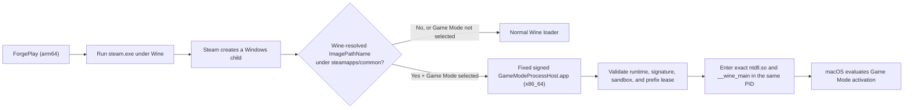

# ForgePlay Source — English

[한국어](README_KO.md) | [Language index](README.md)

## The position, stated plainly

CodeWeavers' contributions to the Wine ecosystem are real and deserve credit.
Those contributions do not create exclusive ownership of Wine's public source,
public macOS behavior, or the right to design a Windows-game compatibility
layer.

ForgePlay started from a simple premise. For a long time, CrossOver had very
few like-for-like competitors in the macOS Windows-gaming market. When there
is little competition, there is also less pressure to test whether a different
architecture is possible. ForgePlay was built to demonstrate, in inspectable
source rather than rhetoric, that an implementation path distinct from
CrossOver can work.

Solving the same problem does not by itself make one product a copy of another.
The relevant evidence is provenance, code boundaries, build structure, shipped
components, and the license attached to each component. That is why ForgePlay
is publishing the implementation instead of hiding it. Anyone can inspect,
compare, fork, or challenge the claims against the code.

## What ForgePlay is not

- It is not a front end that launches or wraps an installed copy of CrossOver.
- It does not depend on CrossOver bottle directories, product bundles,
  executables, or private patches.
- It does not present CodeWeavers' private implementation as ForgePlay-authored
  code.
- It does not claim ownership of Wine, D3DMetal, or other third-party
  components.

ForgePlay is based on Wine. The exact Wine source and ForgePlay patch set are
published with versions, hashes, and provenance. D3DMetal is a separately
licensed third-party component and its binary is not included in this source
export. Bundling open-source and separately licensed components—and selling
the resulting product—is not inherently contradictory. CrossOver's commercial
distribution model does not establish exclusive authority over another
implementation. Each project must be evaluated by what it actually ships,
where those components came from, and the terms that govern them.

## How the Steam integration actually works

Precisely stated, ForgePlay does not link the Steamworks SDK and does not hook
`steam_api.dll` or `steam_api64.dll`. It does not pretend to use a private
Steam API. It uses Steam's local installation metadata, the real Steam client,
and the normal process lineage created by Steam.

1. `SteamLibraryScanner.swift` reads `libraryfolders.vdf` and
   `appmanifest_*.acf` to discover installed libraries and game metadata.
2. ForgePlay launches the real `steam.exe` inside its managed Wine prefix. It
   does not impersonate Steam by directly substituting a game executable.
3. Steam remains the canonical Windows parent and creates the game or launcher
   child.
4. ForgePlay's Wine patches carry the selected renderer, network-adapter
   presentation, audio-input policy, and Steam-game lineage across the
   process-creation boundary.
5. Game Mode eligibility does not trust a command line, game title, account
   name, volume name, or Steam App ID. It is derived on the Unix side from
   Wine's resolved `RTL_USER_PROCESS_PARAMETERS.ImagePathName`.
6. Only an actual executable structurally located below
   `steamapps/common` is eligible. `_CommonRedist` and other infrastructure
   processes are excluded. If a launcher later creates the long-lived game
   process, that child is evaluated independently.

Steam therefore continues to own login, updates, entitlement checks, game
selection, and child-process creation. ForgePlay preserves that normal launch
lineage and applies compatibility policy at Wine's process boundary.

## Renderer selection is separate from Game Mode

Before a Steam session begins, the user selects exactly one of D3DMetal
Standard, D3DMetal NVIDIA/DLSS Compatibility, DXMT, D9VK, or DXVK. Both
D3DMetal choices use the same renderer; only the experimental NVIDIA choice
adds `D3DM_VENDOR_ID=0x10de` to routed game children. It does not force
DirectX 11/12 or guarantee that a game's DLSS path will work. Steam and Steam
WebHelper remain on the base Wine renderer path. The selected renderer is
applied only to game children under `steamapps/common`. A missing or invalid
selection is rejected instead of silently falling back to another renderer.

Renderer selection and Game Mode eligibility are independent. Selecting
D3DMetal does not automatically enable Game Mode, and selecting Game Mode does
not replace the chosen renderer.

On the same launch screen, the user explicitly selects Standard, Wi-Fi, or
Ethernet adapter presentation and audio input disabled or enabled for every
session. The network choice changes only the adapter type visible to games; it
does not convert TCP and UDP. Audio input disabled exposes zero Windows capture
endpoints before CoreAudio input access while preserving audio output. These
values are neither stored per game nor restored automatically.

## How Game Mode is implemented

A standard Steam session uses Wine's normal loader. The Game Mode route is an
explicitly selected beta feature.



The implementation flow is:

1. The outer ForgePlay app preflights the fixed host bundle and exact runtime
   identity.
2. Before PE mapping begins for an accepted Steam child, the Wine loader
   `exec`s that process into the fixed in-app path
   `Contents/Helpers/GameModeProcessHost.app`.
3. This does not generate one application per game. The transition preserves
   the existing Darwin PID, `argv`, current directory, inherited handles, and
   Wine server context.
4. `GameModeProcessHost` is a fixed `x86_64` Mach-O application target built
   separately from the outer ForgePlay executable. It runs through Rosetta on
   Apple Silicon.
5. The host revalidates its bundle identity, code and runtime identity, the
   app-group sandbox boundary, fixed IPC/evidence paths, Wine loader path and
   hash, and the prefix execution lease.
6. After validation, it loads the exact bundled `x86_64-unix/ntdll.so` and
   enters `__wine_main` in the same PID.
7. A required host or contract failure is fail-closed. The accepted game child
   does not silently fall back to the normal Wine loader.
8. The host declares `LSSupportsGameMode=true` and the games category. macOS,
   not ForgePlay, ultimately decides whether Game Mode activates for the
   observed execution context.

“Independent binary” has a specific meaning here:
`GameModeProcessHost` is a fixed Mach-O executable compiled and signed as its
own target by the ForgePlay project. It does not run a renamed CrossOver host
binary. It does not mean that every byte in the host is an original loader
unrelated to Wine.

## The exact clean-room and Wine-derived boundary

ForgePlay makes a strong claim without obscuring provenance.

| Area | Implementation and source | ForgePlay claim |
| --- | --- | --- |
| Steam discovery and session orchestration | ForgePlay source using VDF/ACF metadata and the real Steam launch path | Independently authored |
| Game Mode control plane | Target classification, fixed-host routing, identity/sandbox/lease validation, evidence, and lifecycle written from public macOS behavior and the project's execution contract | Clean-room orchestration with no dependency on CrossOver private code |
| `GameModeProcessHost` artifact | A fixed `x86_64` Mach-O built as a separate application target in `project.yml` | Independently built and signed binary target |
| Same-PID Wine entry | Address reservations, `wine_main_preload_info`, `ntdll.so` loading, and the `__wine_main` call derived from Wine 11.12 `loader/main.c` | Explicitly attributed Wine-derived code, not claimed as clean-room |
| D3DMetal bridge | A ForgePlay Wine patch written against a public Apple interface and an observable ABI contract | Independent adapter at the published boundary; no claim to D3DMetal itself |
| D3DMetal payload | A separately licensed Apple third-party binary | Excluded from this source tree and not relicensed |

In particular, the low-level Wine-loader entry in
`GameModeProcessHost.m` is derived from Wine 11.12. ForgePlay does not hide
that fact or describe it as a “100% clean-room Wine loader.” Exact lineage,
upstream hashes, and license treatment are recorded in
`Native/GameModeProcessHost/SOURCE-CONTRACT.md`. The target classifier, fixed
host contract, runtime identity, app-group boundary, prefix lease, fail-closed
policy, and evidence system are the ForgePlay-authored Game Mode
orchestration.

The distinction matters. Modifying public Wine source under its license is not
the same claim as copying a private CrossOver implementation. ForgePlay
discloses the former and does not claim to have done the latter.

## Where to verify the claims in source

- Steam installation discovery:
  `Sources/ForgePlay/Services/SteamLibraryScanner.swift`
- Steam launch environment and host preflight:
  `Sources/ForgePlay/Services/SafeProcessRunner.swift`
- Direct Game Mode target classification:
  `Resources/Runners/ForgePlayRuntime/Patches/wine-11.12-game-mode-direct-target-scope.patch`
- Fixed process-host routing:
  `Resources/Runners/ForgePlayRuntime/Patches/wine-11.12-game-mode-process-host-routing.patch`
- Separate host target:
  `project.yml`
- Host implementation contract:
  `Native/GameModeProcessHost/README.md`
- Exact boundary of Wine-derived host code:
  `Native/GameModeProcessHost/SOURCE-CONTRACT.md`
- Wine 11.12 source URL, hashes, patches, and reconstruction record:
  `Resources/Runners/ForgePlayRuntime/SOURCE-AVAILABILITY.md`
- Wine patch for manual NVIDIA vendor, network presentation, and audio input:
  `Resources/Runners/ForgePlayRuntime/Patches/wine-11.12-steam-session-compatibility-controls.patch`
- TCP/UDP, adapter-type, and capture-endpoint probe:
  `Scripts/test-wine-session-compatibility.sh`
- Patch provenance lock:
  `Config/ForgePlayRuntimePatchProvenance.lock.json`

These claims are verifiable against those files. If documentation and code
ever disagree, the code, hashes, and reproducible build record are the evidence
to test.

## Included and intentionally excluded

Included:

- ForgePlay Swift and Objective-C source
- Game Mode process-host source and build contract
- Game Mode unit/routing tests and the Steam session compatibility probe source
- ForgePlay-authored Wine patches and Windows launcher source
- XcodeGen project specification and non-personal build settings
- Canonical license texts, scope records, and localized notices
- Runtime provenance and reconstruction tools

Intentionally excluded:

- `ForgePlay.app`, DMGs, archives, and notarization material
- built Wine, D3DMetal, renderer, GStreamer, SDL, and other binaries
- personal Xcode settings, signing-team overrides, certificates, private keys,
  and credentials
- internal planning documents, QA evidence, and release-session material

`Resources/CompatibilityDBPublicKey.base64` is a public verification key for
optional compatibility-database updates. It is not a private signing key.

## Generate the Xcode project

Install XcodeGen and run this from the repository root:

```sh
Scripts/generate-xcode-project.sh
```

To check a source-only build without signing:

```sh
xcodebuild build \
  -project ForgePlay.xcodeproj \
  -scheme ForgePlay \
  -configuration Release \
  -destination 'platform=macOS' \
  CODE_SIGNING_ALLOWED=NO
```

This source-only export does not contain the Windows compatibility runtime
binaries, so it cannot launch Windows games by itself. Runtime reconstruction
records are under `Resources/Runners/ForgePlayRuntime/`; relevant tools are
under `Scripts/`.

## Licensing

ForgePlay is a multi-license project. Read `LICENSE.md` before copying,
modifying, or distributing material. `SOURCE-LICENSES.md` explains how
per-file SPDX identifiers, mixed-file symbol scope, and `.license` sidecars
for the two Game Mode Wine patches map to the authoritative policy.

The exact `GPL-3.0-only` scope for ForgePlay Game Mode is recorded in
`LICENSES/ForgePlayGameMode/GAME_MODE_LICENSE_SCOPE.md`. Unmodified GPL and
LGPL texts are included under `LICENSES/`. Do not infer that every file has
been blanket-relicensed merely because it appears in this directory.
Third-party components remain under their respective terms.

---

ForgePlay Game Mode  
Copyright (C) 2026 Facta-Leopard  
Original source: https://github.com/Facta-Leopard/ForgePlay
